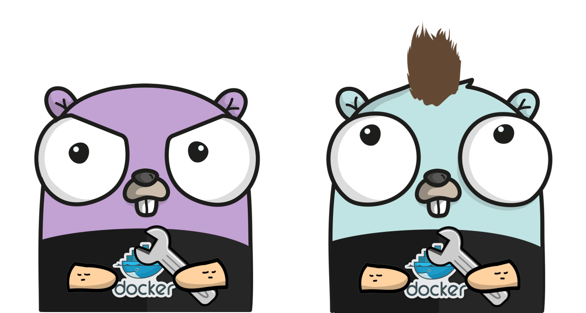

# Traefik Ondemand Plugin

Traefik middleware to start containers on demand.


- [Traefik Ondemand Plugin](#traefik-ondemand-plugin)
  - [Features](#features)
  - [Usage](#usage)
    - [Plugin configuration](#plugin-configuration)
      - [Strategies](#strategies)
      - [Custom loading/error pages](#custom-loadingerror-pages)
    - [Traefik-Ondemand-Service](#traefik-ondemand-service)
  - [Examples](#examples)
  - [Development](#development)
  - [Authors](#authors)

## Features

- Support for **Docker** containers
- Support for **Docker swarm** mode, scale services
- Support for **Kubernetes** Deployments and Statefulsets
- Start your container/service on the first request
- Automatic **scale to zero** after configured timeout upon last request the service received
- Dynamic loading page (cloudflare or grafana cloud style)
- Customize dynamic and loading pages


## Usage

### Plugin configuration

#### Strategies

**Dynamic Strategy (default)**

_Serve an HTML page that self reload._

```yml
testData:
  serviceUrl: http://ondemand:10000
  name: TRAEFIK_HACKATHON_whoami
  timeout: 1m
  waitui: true
```

**Blocking Strategy**

Blocking strategy is enabled by setting `waitui` to `false`.

Instead of displaying a self refreshing page, the request hangs until the service is ready to receive the request.

The timeout is set by `blockdelay`.

```yml
testData:
  serviceUrl: http://ondemand:10000
  name: TRAEFIK_HACKATHON_whoami
  timeout: 1m
  waitui: false
  blockdelay: 1m
```

*Typical use case: an API calling another API*

#### Custom loading/error pages

The `loadingpage` and `errorpage` keys in the plugin configuration can be used to override the default loading and error pages.

The value should be a path where a template that can be parsed by Go's [html/template](https://pkg.go.dev/html/template) package can be found in the Traefik container.

An example of both a loading page and an error page template can be found in the [pkg/pages/](pkg/pages/) directory in [loading.html](pkg/pages/loading.html) and [error.html](pkg/pages/error.html) respectively.

The plugin will default to the built-in loading and error pages if these fields are omitted.

You must include `<meta http-equiv="refresh" content="5" />` inside your html page to get auto refresh.

**Example Configuration**

```yml
testData:
  serviceUrl: http://ondemand:10000
  name: TRAEFIK_HACKATHON_whoami
  timeout: 1m
  waitui: false
  blockdelay: 1m
  loadingpage: /etc/traefik/plugins/traefik-ondemand-plugin/custompages/loading.html
  errorpage: /etc/traefik/plugins/traefik-ondemand-plugin/custompages/error.html
```

| Parameter     | Type            | Default | Required                       | Example                                                                 | Description                                                                           |
| ------------- | --------------- | ------- | --------                       | ----------------------------------------------------------------------- | ------------------------------------------------------------------------------------- |
| `serviceUrl`  | `string`        | empty   | yes                            | `http://ondemand:10000`                                                 | The docker container name, or the swarm service name                                  |
| `name`        | `string`        | empty   | yes (except if `names` is set) | `TRAEFIK_HACKATHON_whoami`                                              | The container/service/kubernetes resource to be stopped (docker ps docker service ls) |
| `names`       | `[]string`      | []      | yes (except if `name` is set)  | `[TRAEFIK_HACKATHON_whoami-1, TRAEFIK_HACKATHON_whoami-2]`              | The containers/services to be stopped (docker ps docker service ls)                   |
| `timeout`     | `time.Duration` | `1m`    | no                             | `1m30s`                                                                 | The duration after which the container/service will be scaled down to 0               |
| `waitui`      | `bool`          | `true`  | no                             | `true`                                                                  | Serves a self-refreshing html page when the service is scaled down to 0               |
| `blockdelay`  | `time.Duration` | `1m`    | no                             | `1m30s`                                                                 | When `waitui` is `false`, wait for the service to be scaled up before `blockdelay`    |
| `loadingpage` | `string`        | empty   | no                             | `/etc/traefik/plugins/traefik-ondemand-plugin/custompages/loading.html` | The path in the traefik container for the **loading** page template                   |
| `errorpage`   | `string`        | empty   | no                             | `/etc/traefik/plugins/traefik-ondemand-plugin/custompages/error.html`   | The path in the traefik container for the **error** page template                     |

### Traefik-Ondemand-Service

The [traefik-ondemand-service](https://github.com/acouvreur/traefik-ondemand-service) must be used to bypass [Yaegi](https://github.com/traefik/yaegi) limitations.

Yaegi is the interpreter used by Traefik to load plugin and run them at runtime.

The docker library that interacts with the docker deamon uses `unsafe` which must be specified when instanciating Yaegi. Traefik doesn't, and probably never will by default.

## Examples

- [Docker Classic](./examples/docker_classic/)
- [Docker Swarm](./examples/docker_swarm/)
- [Multiple Containers](./examples/multiple_containers/)
- [Kubernetes](./examples/kubernetes/)

## Development

`export TRAEFIK_PILOT_TOKEN=xxxxxxxx-xxxx-xxxx-xxxx-xxxxxxxxxxxx`
`docker stack deploy -c docker-compose.yml TRAEFIK_HACKATHON`

## Authors

[Alexis Couvreur](https://www.linkedin.com/in/alexis-couvreur/) (left)
[Alexandre Hiltcher](https://www.linkedin.com/in/alexandre-hiltcher/) (middle)
[Matthias Schneider](https://www.linkedin.com/in/matthias-schneider-18831baa/) (right)


