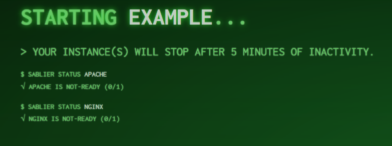

# Sablier

   

Sablier is an API that start containers for a given duration.

It provides an integrations with multiple reverse proxies and different loading strategies.

Which allows you to start your containers on demand and shut them down automatically as soon as there's no activity.


- [Sablier](#sablier)
  - [Quick start with Traefik](#quick-start-with-traefik)
  - [Reverse proxies integration plugins](#reverse-proxies-integration-plugins)
    - [Traefik Middleware Plugin](#traefik-middleware-plugin)
  - [Guides](#guides)
    - [Sablier Guide: Code-Server + Traefik + Kubernetes Ingress](#sablier-guide-code-server--traefik--kubernetes-ingress)
  - [Configuration](#configuration)
    - [Configuration File](#configuration-file)
    - [Environment Variables](#environment-variables)
    - [Arguments](#arguments)
  - [Install Sablier on its own](#install-sablier-on-its-own)
    - [Use the Docker image](#use-the-docker-image)
    - [Use the binary distribution](#use-the-binary-distribution)
    - [Compile your binary from the sources](#compile-your-binary-from-the-sources)
  - [Loading with a waiting page](#loading-with-a-waiting-page)
    - [Dynamic Strategy Configuration](#dynamic-strategy-configuration)
    - [Creating your own loading theme](#creating-your-own-loading-theme)
  - [Blocking the loading until the session is ready](#blocking-the-loading-until-the-session-is-ready)
  - [Saving the state to a file](#saving-the-state-to-a-file)
  - [Sablier Healthcheck](#sablier-healthcheck)
    - [Using the `/health` route](#using-the-health-route)
    - [Using the `sablier health` command](#using-the-sablier-health-command)
  - [API](#api)
    - [GET `/api/strategies/dynamic`](#get-apistrategiesdynamic)
    - [GET `/api/strategies/blocking`](#get-apistrategiesblocking)
  - [Glossary](#glossary)
  - [Versioning](#versioning)
  - [Credits](#credits)

## Quick start with Traefik

You will see how to use Sablier with Traefik in order to start your container automatically when reaching it by its route.


```bash
git clone https://github.com/acouvreur/sablier
cd sablier
docker-compose up -d
docker-compose stop whoami

# Now you go to http://localhost:8080/whoami/dynamic with your browser
# Or you can call the blocking URL, this will wait until whoami is started
curl http://localhost:8080/whoami/blocking

Hostname: 1d034329b651
IP: 127.0.0.1
IP: 172.18.0.2
RemoteAddr: 172.18.0.4:33052
GET /whoami/blocking HTTP/1.1
Host: localhost:8080
User-Agent: curl/7.68.0
Accept: */*
Accept-Encoding: gzip
X-Forwarded-For: 172.18.0.1
X-Forwarded-Host: localhost:8080
X-Forwarded-Port: 8080
X-Forwarded-Proto: http
X-Forwarded-Server: 1aea141808c5
X-Real-Ip: 172.18.0.1
```

## Reverse proxies integration plugins

The reverse proxy integrations is probably what you're most interested about.

It leverage the API calls to Sablier to your reverse proxy middleware to wake up your instances on demand.


### Traefik Middleware Plugin

See [Traefik Middleware Plugin](https://github.com/acouvreur/sablier/tree/main/plugins/traefik/README.md)

- [Traefik Middleware Plugin with Docker classic](https://github.com/acouvreur/sablier/tree/main/plugins/traefik/README.md#traefik-with-docker-classic)
- [Traefik Middleware Plugin with Docker Swarm](https://github.com/acouvreur/sablier/tree/main/plugins/traefik/README.md#traefik-with-docker-swarm)
- [Traefik Middleware Plugin with Kubernetes](https://github.com/acouvreur/sablier/tree/main/plugins/traefik/README.md#traefik-with-kubernetes)

## Guides

### Sablier Guide: Code-Server + Traefik + Kubernetes Ingress

See [Sablier Guide: Code-Server + Traefik + Kubernetes Ingress](./docs/guides/code-server-traefik-kubernetes.md)

## Configuration

There are three different ways to define configuration options in Sablier:

1. In a configuration file
2. As environment variables
3. In the command-line arguments

These ways are evaluated in the order listed above.

If no value was provided for a given option, a default value applies.

### Configuration File

At startup, Sablier searches for configuration in a file named sablier.yml (or sablier.yaml) in:

- `/etc/sablier/`
- `$XDG_CONFIG_HOME/`
- `$HOME/.config/`
- `.` *(the working directory).*

You can override this using the configFile argument.

```bash
sablier --configFile=path/to/myconfigfile.yml
```

```yaml
provider:
  # Provider to use to manage containers (docker, swarm, kubernetes)
  name: docker 
server:
  # The server port to use
  port: 10000 
  # The base path for the API
  base-path: /
storage:
  # File path to save the state (default stateless)
  file:
sessions:
  # The default session duration (default 5m)
  default-duration: 5m
  # The expiration checking interval. 
  # Higher duration gives less stress on CPU. 
  # If you only use sessions of 1h, setting this to 5m is a good trade-off.
  expiration-interval: 20s
logging:
  level: trace
strategy:
  dynamic:
    # Custom themes folder, will load all .html files recursively (default empty)
    custom-themes-path:
    # Show instances details by default in waiting UI
    show-details-by-default: false
    # Default theme used for dynamic strategy (default "hacker-terminal")
    default-theme: hacker-terminal
    # Default refresh frequency in the HTML page for dynamic strategy
    default-refresh-frequency: 5s
  blocking:
    # Default timeout used for blocking strategy (default 1m)
    default-timeout: 1m
```

### Environment Variables

All environment variables can be used in the form of the config file such as 

```yaml
strategy:
  dynamic:
    custom-themes-path: /my/path
```

Becomes

```bash
STRATEGY_DYNAMIC_CUSTOM_THEMES_PATH=/my/path
```

### Arguments

To get the list of all available arguments:

```bash
sablier --help

# or

docker run acouvreur/sablier[:version] --help
# ex: docker run acouvreur/sablier:1.2.0 --help
```

All arguments can be used in the form of the config file such as 

```yaml
strategy:
  dynamic:
    custom-themes-path: /my/path
```

Becomes

```bash
sablier start --strategy.dynamic.custom-themes-path /my/path
```

## Install Sablier on its own

You can install Sablier with the following flavors:

- Use the Docker image
- Use the binary distribution
- Compile your binary from the sources

### Use the Docker image

- **Docker Hub**: [acouvreur/sablier](https://hub.docker.com/r/acouvreur/sablier)
- **Github Container Registry**: [ghcr.io/acouvreur/sablier](https://github.com/acouvreur/sablier/pkgs/container/sablier)
  
Choose one of the Docker images and run it with one sample configuration file:

- [sablier.yaml](https://raw.githubusercontent.com/acouvreur/sablier/main/sablier.sample.yaml)

```bash
docker run -d -p 10000:10000 \
    -v $PWD/sablier.yml:/etc/sablier/sablier.yml acouvreur/sablier:1.2.0
```

### Use the binary distribution

Grab the latest binary from the [releases](https://github.com/acouvreur/sablier/releases) page.

And run it:

```bash
./sablier --help
```

### Compile your binary from the sources

```bash
git clone git@github.com:acouvreur/sablier.git
cd sablier
make
# Output will change depending on your distro
./sablier_draft_linux-amd64
```

## Loading with a waiting page

**The Dynamic Strategy provides a waiting UI with multiple themes.**
This is best suited when this interaction is made through a browser.

|       Name        |                                                  Preview                                                  |
| :---------------: | :-------------------------------------------------------------------------------------------------------: |
|      `ghost`      |                      |
|     `shuffle`     |                  |
| `hacker-terminal` |  |
|     `matrix`      |                    |

### Dynamic Strategy Configuration

```yaml
strategy:
  dynamic:
    # Custom themes folder, will load all .html files recursively (default empty)
    custom-themes-path:
    # Show instances details by default in waiting UI
    show-details-by-default: false
    # Default theme used for dynamic strategy (default "hacker-terminal")
    default-theme: hacker-terminal
    # Default refresh frequency in the HTML page for dynamic strategy
    default-refresh-frequency: 5s
```

### Creating your own loading theme

See [creating your own theme](docs/THEMES.md).

## Blocking the loading until the session is ready

**The Blocking Strategy waits for the instances to load before serving the request**
This is best suited when this interaction from an API.

```yaml
strategy:
  blocking:
    # Default timeout used for blocking strategy (default 1m)
    default-timeout: 1m
```

## Saving the state to a file

You can save the state of the application in case of failure to resume your sessions.

For this you can use the `storage` configuration.

```yml
storage:
  file: /path/to/file.json
```

If the file doesn't exist it will be created, and it will be syned upon exit.

Loaded instances that expired during the restart won't be changed though, they will simply be ignored.

## Sablier Healthcheck

### Using the `/health` route

You can use the route `/health` to check for healthiness.

- Returns 200 `OK` when ready
- Returns 503 `Service Unavailable` when terminating

### Using the `sablier health` command

You can use the command `sablier health` to check for healthiness.

`sablier health` takes on argument `--url` which defaults to `http://localhost:10000/health`.

```yml
services:
  sablier:
    image: acouvreur/sablier:1.2.0
    healthcheck:
      test: ["sablier", "health"]
      interval: 1m30s
```

## API

To run the following examples you can create two containers:

- `docker create --name nginx nginx`
- `docker create --name apache httpd`

### GET `/api/strategies/dynamic`

**Description**: The `/api/strategies/dynamic` endpoint allows you to request a waiting page for multiple instances

| Parameter                        | Value                                                                | Description                                                                      |
| -------------------------------- | -------------------------------------------------------------------- | -------------------------------------------------------------------------------- |
| `names`                          | array of string                                                      | The instances to be started                                                      |
| `session_duration`               | duration [time.ParseDuration](https://pkg.go.dev/time#ParseDuration) | The session duration for all services, which will reset at each subsequent calls |
| `show_details` *(optional)*      | bool                                                                 | The details about instances                                                      |
| `display_name` *(optional)*      | string                                                               | The display name                                                                 |
| `theme` *(optional)*             | string                                                               | The theme to use                                                                 |
| `refresh_frequency` *(optional)* | duration [time.ParseDuration](https://pkg.go.dev/time#ParseDuration) | The refresh frequency for the loading page                                       |

Go to http://localhost:10000/api/strategies/dynamic?names=nginx&names=apache&session_duration=5m&show_details=true&display_name=example&theme=hacker-terminal&refresh_frequency=10s and you should see

A special header `X-Sablier-Session-Status` is returned and will have the value `ready` if all instances are ready. Or else `not-ready`.



### GET `/api/strategies/blocking`

**Description**: The `/api/strategies/blocking` endpoint allows you to wait until the instances are ready

| Parameter              | Value                                                                | Description                                                                      |
| ---------------------- | -------------------------------------------------------------------- | -------------------------------------------------------------------------------- |
| `names`                | array of string                                                      | The instances to be started                                                      |
| `session_duration`     | duration [time.ParseDuration](https://pkg.go.dev/time#ParseDuration) | The session duration for all services, which will reset at each subsequent calls |
| `timeout` *(optional)* | duration [time.ParseDuration](https://pkg.go.dev/time#ParseDuration) | The maximum time to wait for instances to be ready                               |

A special header `X-Sablier-Session-Status` is returned and will have the value `ready` if all instances are ready. Or else `not-ready`.

**Curl example**
```bash
curl -X GET -v "http://localhost:10000/api/strategies/blocking?names=nginx&names=apache&session_duration=5m&timeout=5s"
*   Trying 127.0.0.1:10000...
* Connected to localhost (127.0.0.1) port 10000 (#0)
> GET /api/strategies/blocking?names=nginx&names=apache&session_duration=5m&timeout=30s HTTP/1.1
> Host: localhost:10000
> User-Agent: curl/7.74.0
> Accept: */*
> 
* Mark bundle as not supporting multiuse
< HTTP/1.1 200 OK
< Content-Type: application/json; charset=utf-8
< X-Sablier-Session-Status: ready
< Date: Mon, 14 Nov 2022 19:20:50 GMT
< Content-Length: 245
< 
{"session":
  {"instances":
    [
      {"instance":{"name":"nginx","currentReplicas":1,"desiredReplicas":1,"status":"ready"},"error":null},
      {"instance":{"name":"apache","currentReplicas":1,"desiredReplicas":1,"status":"ready"},"error":null}
    ],
    "status":"ready"
  }
}
```

## Glossary

I'll use these terms in order to be provider agnostic.

- **Session**: A Session is a set of **instances**
- **Instance**: An instance is either a docker container, docker swarm service, kubernetes deployment or kubernetes statefulset

## Versioning

Sablier follows the [Semantic Versioning 2.0.0](https://semver.org/) Specification (SemVer).

Given a version number MAJOR.MINOR.PATCH, increment the:

  1.  MAJOR version when you make incompatible API changes
  2.  MINOR version when you add functionality in a backwards compatible manner
  3.  PATCH version when you make backwards compatible bug fixes

Additional labels for pre-release and build metadata are available as extensions to the MAJOR.MINOR.PATCH format.

This process is fully automated using [Semantic Release](https://github.com/semantic-release/semantic-release).

The configuration is [release.config.js](https://github.com/acouvreur/sablier/blob/main/release.config.js).

## Credits

- [Hourglass icons created by Vectors Market - Flaticon](https://www.flaticon.com/free-icons/hourglass)
- [tarampampam/error-pages](https://github.com/tarampampam/error-pages/) for the themes