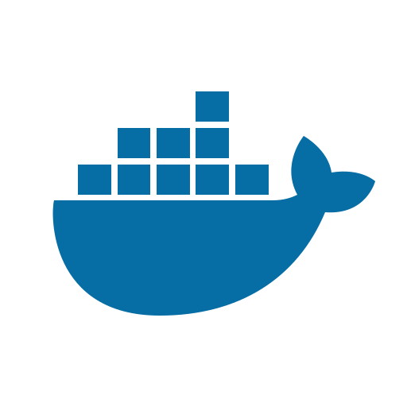
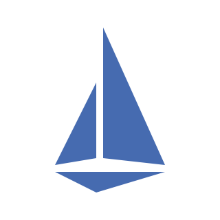

- [Introduction](/)
- [Getting started](/getting-started)
- [Installation](/installation)
- [Configuration](/configuration)
- [Strategies](/strategies)
- [Themes](/themes)
- [FAQ](/faq)
- [Versioning](/versioning)
- **Providers**
  - [Overview](/providers/overview)
  - [Docker](/providers/docker)
  - [Docker Swarm](/providers/docker_swarm)
  - [Kubernetes](/providers/kubernetes)
- **Reverse Proxy Plugins**
  - [Overview](/plugins/overview)
  - [Apache APISIX](/plugins/apacheapisix)
  - [Caddy](/plugins/caddy) 
  - [Envoy](/plugins/envoy)
  - [Istio](/plugins/istio)
  - [Nginx (NJS)](/plugins/nginx)
  - [Nginx (ProxyWasm)](/plugins/nginx_proxywasm)
  - [ Traefik](/plugins/traefik)
- **Guides**
  - [Overview](/guides/overview)
  - [VSCode Server with Traefik and Kubernetes](/guides/code-server-traefik-kubernetes.md)
- **Links**
- [Github](https://github.com/acouvreur/sablier)
- [Docker Hub](https://hub.docker.com/r/acouvreur/sablier)