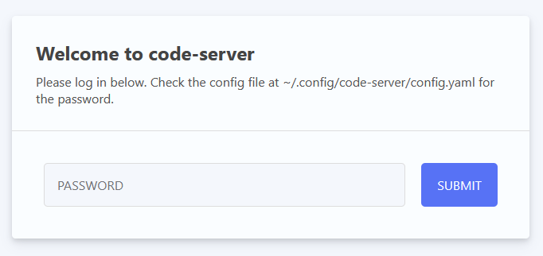
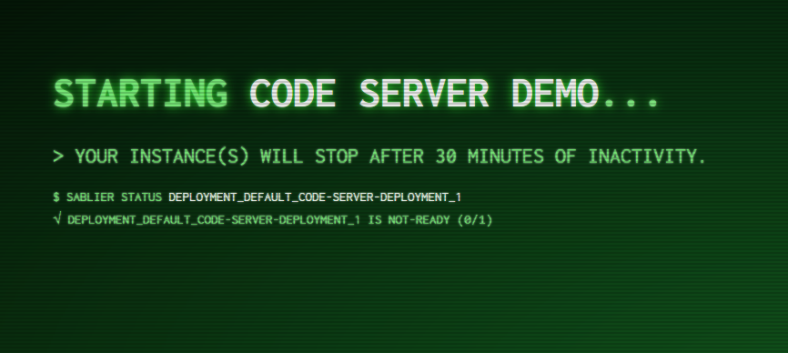

# Sablier Guide: Code-Server + Traefik + Kubernetes Ingress

- [Sablier Guide: Code-Server + Traefik + Kubernetes Ingress](#sablier-guide-code-server--traefik--kubernetes-ingress)
  - [1. Prerequisites](#1-prerequisites)
  - [2. Create the Kubernetes Cluster using K3S](#2-create-the-kubernetes-cluster-using-k3s)
  - [3. Deploy Traefik using Helm](#3-deploy-traefik-using-helm)
  - [3. Deploy Sablier](#3-deploy-sablier)
  - [4. Deploy Code-Server](#4-deploy-code-server)
  - [5. Routing Code-Server through Traefik with the Sablier Plugin Middleware](#5-routing-code-server-through-traefik-with-the-sablier-plugin-middleware)
  - [6. Clean up](#6-clean-up)

## 1. Prerequisites

- `docker` command
- `kubectl` command
- `helm` command

## 2. Create the Kubernetes Cluster using K3S

1. Copy the following content to a file called `docker-compose.yml` and run `docker compose up -d`
    ```yml
    version: '3'
    services:
      server:
        image: "rancher/k3s:v1.23.12-k3s1"
        command: server --no-deploy traefik
        tmpfs:
          - /run
          - /var/run
        ulimits:
          nproc: 65535
          nofile:
            soft: 65535
            hard: 65535
        privileged: true
        restart: always
        environment:
          - K3S_KUBECONFIG_OUTPUT=/output/kubeconfig.yaml
          - K3S_KUBECONFIG_MODE=666
        volumes:
          # This is just so that we get the kubeconfig file out
          - .:/output
        ports:
          - 6443:6443  # Kubernetes API Server
          - 8080:80  # Ingress controller port 80
    ```
2. Wait for the cluster to be ready with command
    ```bash
    export KUBECONFIG=$(pwd)/kubeconfig.yaml
    until kubectl get nodes | grep " Ready "; do sleep 1; done
    ```

## 3. Deploy Traefik using Helm

1. Add the traefik Helm repository
    ```bash
    helm repo add traefik https://helm.traefik.io/traefik
    helm repo update
    ```
2. Create the [values.yaml](https://helm.sh/docs/chart_template_guide/values_files/) file
    ```yml
    image:
      tag: "2.9.1"

    experimental:
      plugins:
        enabled: true

    additionalArguments:
      - "--experimental.plugins.sablier.moduleName=github.com/acouvreur/sablier"
      - "--experimental.plugins.sablier.version=v1.3.0"

    providers:
      kubernetesIngress:
        enabled: true
        allowEmptyServices: true
    ```
3. Install the traefik chart with our `values.yaml` file
    ```bash
    helm install traefik traefik/traefik -f values.yaml --namespace kube-system
    ```

## 3. Deploy Sablier

1. Create Sablier Service Account file `sablier-sa.yaml` and then `kubectl apply -f sablier-sa.yaml`
    ```yml
    apiVersion: v1
    kind: ServiceAccount
    metadata:
      name: sablier
      namespace: kube-system
    ```
2. Create Sablier Cluster Role file `sablier-cr.yaml` and then `kubectl apply -f sablier-cr.yaml`
    ```yml
    apiVersion: rbac.authorization.k8s.io/v1
    kind: ClusterRole
    metadata:
      name: sablier
      namespace: kube-system
    rules:
      - apiGroups:
          - apps
          - ""
        resources:
          - deployments
          - deployments/scale
          - statefulsets
          - statefulsets/scale
        verbs:
          - patch   # Scale up and down
          - get     # Retrieve info about specific deployment or statefulset
          - update  # Scale up and down
          - list    # Events
          - watch   # Events
    ```
3. Create Sablier Cluster Role Binding `sablier-crb.yaml` and then `kubectl apply -f sablier-crb.yaml`
    ```yml
    apiVersion: rbac.authorization.k8s.io/v1
    kind: ClusterRoleBinding
    metadata:
      name: sablier
      namespace: kube-system
    roleRef:
      apiGroup: rbac.authorization.k8s.io
      kind: ClusterRole
      name: sablier
    subjects:
      - kind: ServiceAccount
        name: sablier
        namespace: kube-system
    ```
4. Create Sablier Deployment `sablier-deployment.yaml` and then `kubectl apply -f sablier-deployment.yaml`
    ```yml
    apiVersion: apps/v1
    kind: Deployment
    metadata:
      name: sablier-deployment
      namespace: kube-system
      labels:
        app: sablier
    spec:
      replicas: 1
      selector:
        matchLabels:
          app: sablier
      template:
        metadata:
          labels:
            app: sablier
        spec:
          serviceAccountName: sablier
          serviceAccount: sablier
          containers:
          - name: sablier
            image: acouvreur/sablier:1.3.0
            args: 
            - "start"
            - "--provider.name=kubernetes"
            ports:
            - containerPort: 10000
    ```
5. Create Sablier Service `sablier-service.yaml` and then `kubectl apply -f sablier-service.yaml`
    ```yml
    apiVersion: v1
    kind: Service
    metadata:
      name: sablier
      namespace: kube-system
    spec:
      selector:
        app: sablier
      ports:
        - protocol: TCP
          port: 10000
          targetPort: 10000
    ```

6. Check with the command `kubectl -n kube-system get deployments`, you should have the following:
    ```bash
    NAME                     READY   UP-TO-DATE   AVAILABLE   AGE
    local-path-provisioner   1/1     1            1           8m25s
    coredns                  1/1     1            1           8m25s
    metrics-server           1/1     1            1           8m24s
    traefik                  1/1     1            1           3m25s
    sablier-deployment       1/1     1            1           90s
    ```
    Or getting the logs `kubectl -n kube-system logs deployments/sablier-deployment`
    ```log
    time="2022-11-14T01:40:49Z" level=info msg="(version=1.1.1, branch=HEAD, revision=a913bc2a3b0f4aca5b9ac7ddc9af5428ef411dba)"
    time="2022-11-14T01:40:49Z" level=info msg="using provider \"kubernetes\""
    time="2022-11-14T01:40:49Z" level=info msg="initialized storage to /etc/sablier/state.json"
    time="2022-11-14T01:40:49Z" level=info msg="server listening :10000"
    ```

Great! Now the Sablier API is available at `http://sablier:10000` inside your cluster.

## 4. Deploy Code-Server

1. Create Code-Server Deployment `code-server-deployment.yaml` and then `kubectl apply -f code-server-deployment.yaml`
    ```yml
    apiVersion: apps/v1
    kind: Deployment
    metadata:
      name: code-server-deployment
      namespace: default
      labels:
        app: code-server
    spec:
      replicas: 1
      selector:
        matchLabels:
          app: code-server
      template:
        metadata:
          labels:
            app: code-server
        spec:
          containers:
          - name: code-server
            image: codercom/code-server:4.8.3
            ports:
            - containerPort: 8080
    ```
2. Create Code-Server Service `code-server-service.yaml` and then `kubectl apply -f code-server-service.yaml`
    ```yml
    apiVersion: v1
    kind: Service
    metadata:
      name: code-server-service
      namespace: default
    spec:
      selector:
        app: code-server
      ports:
        - protocol: TCP
          port: 8080
          targetPort: 8080
    ```
3. Check with the command `kubectl get deployments`, you should have the following:
    ```bash
    NAME                     READY   UP-TO-DATE   AVAILABLE   AGE
    code-server-deployment   1/1     1            1           2m18s
    ```
    Or getting the logs `kubectl logs deployments/code-server-deployment`
    ```log
    [2022-11-14T02:02:20.895Z] info  Wrote default config file to ~/.config/code-server/config.yaml
    [2022-11-14T02:02:21.084Z] info  code-server 4.8.3 977b853a1e162ab583aed64b1322d1515c57728c
    [2022-11-14T02:02:21.085Z] info  Using user-data-dir ~/.local/share/code-server
    [2022-11-14T02:02:21.093Z] info  Using config file ~/.config/code-server/config.yaml
    [2022-11-14T02:02:21.094Z] info  HTTP server listening on http://0.0.0.0:8080/ 
    [2022-11-14T02:02:21.094Z] info    - Authentication is enabled
    [2022-11-14T02:02:21.094Z] info      - Using password from ~/.config/code-server/config.yaml
    [2022-11-14T02:02:21.094Z] info    - Not serving HTTPS
    ```

Great! Now the Code-Server instance is available inside your cluster.

## 5. Routing Code-Server through Traefik with the Sablier Plugin Middleware

1. Create Code-Server Ingress `code-server-ingress.yaml` and then `kubectl apply -f code-server-ingress.yaml`
    ```yml
    apiVersion: networking.k8s.io/v1
    kind: Ingress
    metadata:
      name: code-server-ingress
      namespace: default
      annotations:
        kubernetes.io/ingress.class: traefik
    spec:
      rules:
      - host: localhost
        http:
          paths:
          - path: /
            pathType: Prefix
            backend:
              service:
                name: code-server-service
                port:
                  number: 8080
    ```
2. At this point, the Code-Server is reachable with the following http://localhost:8080
    
3. Scale down the Deployment with `kubectl scale deployment code-server-deployment --replicas=0`
4. Now, because we configured `--providers.kubernetesIngress.allowEmptyServices=true`, if we `curl` again it should show `Service Unavailable`.
    ```bash
    curl http://localhost:8080
    Service Unavailable
    ```
    This is the key to make it work. Traefik would have evicted the service from its pool showing a 404 otherwise.
    Right now, we just need to plugin the Middleware and we're good!
5. Create the Traefik Middleware `code-server-sablier-middleware.yaml` and then `kubectl apply -f code-server-sablier-middleware.yaml`
    ```yml
    apiVersion: traefik.containo.us/v1alpha1
    kind: Middleware
    metadata:
      name: code-server-sablier
      namespace: default
    spec:
      plugin:
        sablier:
          names: deployment_default_code-server-deployment_1
          sablierUrl: 'http://sablier:10000'
          sessionDuration: 30m
          dynamic:
            displayName: 'Code Server Demo'
            showDetails: true
            theme: hacker-terminal
            refreshFrequency: 5s
    ```
6. Create a patch for Code Server Deployment `code-server-ingress-patch.yaml` and then `kubectl patch ingress code-server-ingress --patch-file code-server-ingress-patch.yaml`
    ```yml
    metadata:
      annotations:
        traefik.ingress.kubernetes.io/router.middlewares: default-code-server-sablier@kubernetescrd
    ```
7. Now you can browse http://localhost:8080 and you will see the loading screen while Sablier scales your deployment
    

    And a few seconds later...
    
    

## 6. Clean up

1. `docker compose down`