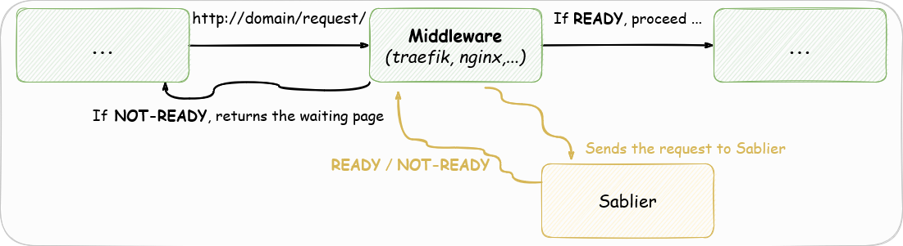

# Reverse Proxy Plugins

## What is a Reverse Proxy Plugin ?

Reverse proxy plugins are the integration with a reverse proxy.

?> Because Sablier is designed as an API that can be used on its own, reverse proxy integrations acts as a client of that API.

It leverages the API calls to plugin integration to catch in-flight requests to Sablier.

## Available Reverse Proxies

| Reverse Proxy                                   | Docker | Docker Swarm mode | Kubernetes |                  
|-------------------------------------------------|:------:|:-----------------:|:----------:|
| [Apache APISIX](/plugins/apacheapisix)          |   ✅    |         ✅         |     ✅      |                                                           
| [Caddy](/plugins/caddy)                         |   ✅    |         ✅         |     ❌      |                                                           
| [Envoy](/plugins/envoy)                         |   ✅    |         ❓         |     ❓      |                                                           
| [Istio](plugins/istio)                          |   ❌    |         ❌         |     ⚠️     |                                                           
| [Nginx (NJS Module)](/plugins/nginx_njs)        |   ✅    |         ✅         |     ✅      |
| [Nginx (WASM Module)](/plugins/nginx_proxywasm) |   ✅    |         ❓         |     ❓      |
| [Traefik](/plugins/traefik)                     |   ✅    |         ✅         |     ✅      |
| [ProxyWasm](/plugins/proxywasm)                 |   ✅    |         ✅         |     ✅      |

> ✅ **Fully compatible**
> 
> ⚠️ **Partially compatible**
> 
> ❓ **Should be compatible (but not tested)**
> 
> ❌ **Not compatible**

*Your Reverse Proxy is not on the list? [Open an issue to request the missing reverse proxy integration here!](https://github.com/acouvreur/sablier/issues/new?assignees=&labels=enhancement%2C+reverse-proxy&projects=&template=reverse-proxy-integration-request.md&title=Add+%60%5BREVERSE+PROXY%5D%60+reverse+proxy+integration)*

## Runtime and Compiled plugins

Some reverse proxies have the capability to evaluate the plugins at runtime (Traefik with Yaegi, NGINX with Lua and JS plugins) which means the reverse proxy provides a way to consume the plugin directly.

Some others enforce you to rebuild your reverse proxy (Caddy).