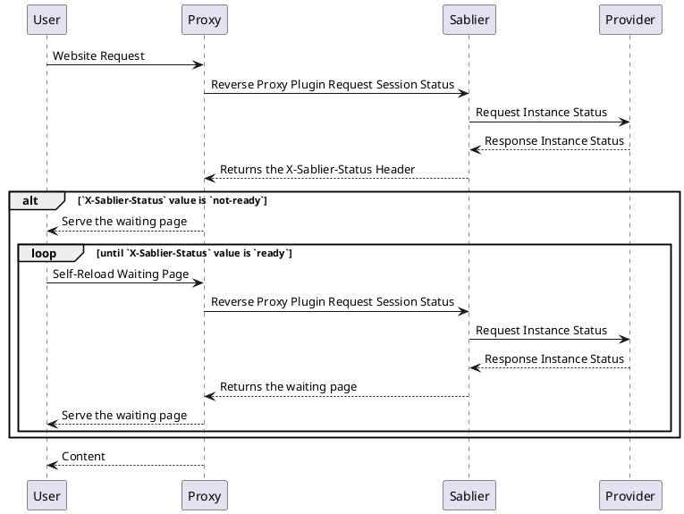
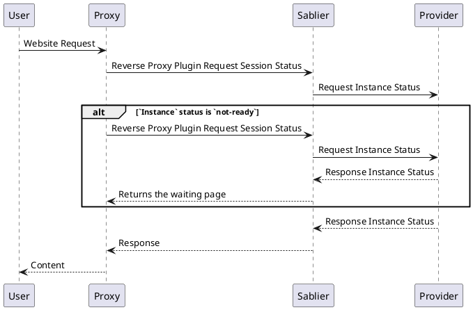

# Strategies

## Dynamic Strategy

The **Dynamic Strategy** provides a waiting page for your session.

?> This strategy is well suited for a user that would access a frontend directly and expects to see a loading page.

## Blocking Strategy

The **Blocking Strategy** hangs the request until your session is ready.

?> This strategy is well suited for an API communication.

